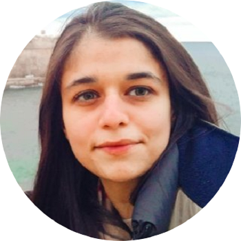
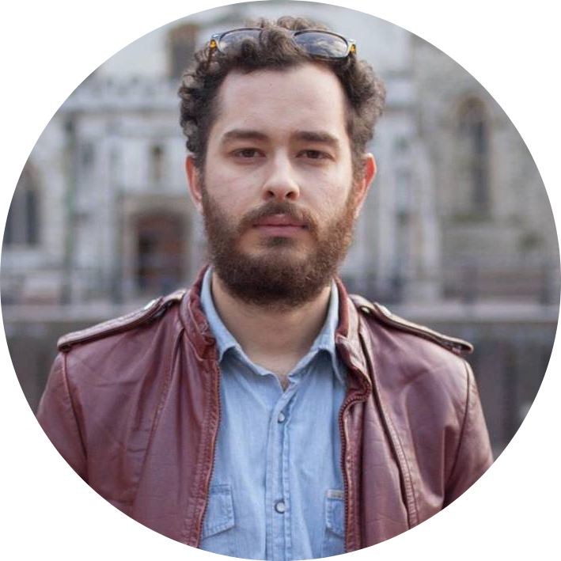

---

 
    <b>TRiRL</b> is a one-day interdisciplinary workshop that aims to push the boundaries of our understanding of brain's ability to represent time and explore the potential benefits for reinforcement learning.

---

# About

The ability to perceive and estimate temporal dynamics can be considered as one of the central elements of intelligent biological agents – equipped with a model of their environment. Similarly, if one takes the view that an agent’s (internal) model is its primary guide to behaviour, the ability to learn appropriate temporal representations and employ them for action selection is a crucial consideration in reinforcement learning (RL).

Currently, RL agents have matured such that model-based unsupervised approaches achieve competitive and even SOTA behaviours (for instance, MuZero - _Schrittwieser et al. 2020_, or DreamerV2 - _Hafner et al. 2020_). However, these models tend to operate over a physical timescale aligned with the shift in environment dynamics. Consequently, further considerations are required to mimic the types of spatio-temporal representations observed in neuronal responses – operating at both subjective and objective (physical) timescales. Indeed, a large amount of neuroimaging and modeling studies in cognitive science have been focused on explaining temporal representations and how they influence human behaviour (using neural networks and Bayesian inference) e.g., _Jazayeri & Shadlen (2010), Roseboom et al. (2019), Deverett et al. (2019), Fountas et al. (2022)._

TRiRL will bring together experts in model-based RL and neuroscientists working on the brain's ability to represent time, in order to exchange insights, brainstorm, and encourage a multi-angle discussion on this important topic.

# Speakers

<table class="speakers">
    <tbody>                
        <tr>
            <td style="padding:2.5%;width:15%;max-width:15%">
                
                

Speaker 1

            </td>
            <td style="padding:2.5%;width:15%;max-width:15%">
                
                

Speaker 2

            </td>
            <td style="padding:2.5%;width:15%;max-width:15%">
                
                

Speaker 3

            </td>
        </tr>
    </tbody>
</table>

# Organisers

    

        

            
            

<a href="https://www.zfountas.com">Zafeirios Fountas</a>   Huawei

        

        

            
            

<a href="https://ucbtns.github.io/index.html">Noor Sajid</a>   UCL &amp; Huawei

        

        

            
            

<a href="https://www.azak.cc">Alex Zakharov </a>  Huawei

        

    

    

        

            
            

<a href="https://www.warrickroseboom.com">Warrick Roseboom </a>  University of Sussex

        

        

            
            

<a href="https://ptigas.com/">Panagiotis Tigas </a>  University of Oxford

        

    

# Mailing list

Sign up to receive the latest updates on the event (programme announcement and livestream):

<!-- <form action="https://docs.google.com/forms/d/e/1FAIpQLScC4e6GMD69dz4qh6lKFPRQ6jjwnsC4tygrjtS5cHuloUCirw/formResponse" method="POST">
  <input style="margin-bottom:3px;" type="text" jsname="YPqjbf" tabindex="0" placeholder="Email address*" required>
  
<button type="submit" class="btn-form">Send</button>

</form> -->

<iframe src="https://docs.google.com/forms/d/e/1FAIpQLScC4e6GMD69dz4qh6lKFPRQ6jjwnsC4tygrjtS5cHuloUCirw/viewform?embedded=true" class="google-form" frameborder="0" marginheight="0" marginwidth="0">Loading…</iframe>

<!-- <input type="email" class="whsOnd zHQkBf" jsname="YPqjbf" autocomplete="email" tabindex="0" aria-label="Your email" required="" dir="auto" data-initial-dir="auto" data-initial-value=""> -->

<!-- <table class="speakers">
    <tbody>               
        <tr>
            <td style="padding:2.5%;width:15%;max-width:15%">
                
                

<a href="https://www.zfountas.com">Zafeirios Fountas</a>   Huawei

            </td>
            <td style="padding:2.5%;width:15%;max-width:15%">
                
                

<a href="https://ucbtns.github.io/index.html">Noor Sajid</a>   UCL &amp; Huawei

            </td>
            <td style="padding:2.5%;width:15%;max-width:15%">
                
                

<a href="https://www.azak.cc">Alex Zakharov </a>  Huawei

            </td>
            <td style="padding:2.5%;width:15%;max-width:15%">
                
                

<a href="https://www.warrickroseboom.com">Warrick Roseboom </a>  University of Sussex

            </td>
        </tr>
    </tbody>
</table> -->

# References

1. Deverett, B., Faulkner, R., Fortunato, M., Wayne, G. & Leibo, J. Z. (2019), ‘Interval timing in deep reinforcement learning agents’, Advances in Neural Information Processing Systems 32.
2. Fountas, Z., Sylaidi, A., Nikiforou, K., Seth, A. K., Shanahan, M. & Roseboom, W. (2022), ‘A predictive processing model of episodic memory and time perception’, (in press) Neural Computation.
3. Hafner, D., Lillicrap, T., Fischer, I., Villegas, R., Ha, D., Lee, H. & Davidson, J. (2019), Learning latent dynamics for planning from pixels, in ‘International conference on machine learning’, PMLR, pp. 2555–2565.
4. Jazayeri, M. & Shadlen, M. N. (2010), ‘Temporal context calibrates interval timing’, Nature neuro- science 13(8), 1020–1026.
5. Roseboom, W., Fountas, Z., Nikiforou, K., Bhowmik, D., Shanahan, M. & Seth, A. K. (2019), ‘Activity in perceptual classification networks as a basis for human subjective time perception’, Nature communications 10(1), 1–9.

